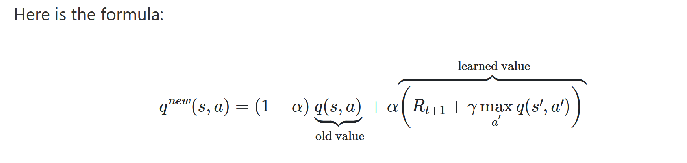

# ReinforcementLearning-FrozenLake

This project implements reinforcement learning, more specifically q learning on FrozenLake game.
The game is from the OpenAI Gym website, which has a gym library that you can install to work in 
various environments. In FrozenLake game, "The agent controls the movement of a character in a grid world. Some
tiles of the grid are walkable, and others lead to the agent falling into the water. 
Additionally, the movement direction of the agent is uncertain and only partially depends on the 
chosen direction. The agent is rewarded for finding a walkable path to a goal tile." I implemented q learning algorithm to train the agent to play the FrozenLake game.


## Environment 

Environemnt detail link : https://gym.openai.com/envs/FrozenLake-v0/

```
SFFF
FHFH
FFFH
HFFG
```
Above grid is the environment, S is the starting point and safe. F is a frozen surface and safe.
H is hole and not safe and you get 0 reward. G is goal where the frisbee is and reward is 1. Its game over
when agent either falls in the hole or reaches the goal stage. Agent can move in left, down, right, up directions.

## Q learning Algorithm 

I have implemented value iteration algorithm. Using gym library, I create an environment for FrozenLake.
Environment includes number of states and number of actions. I create a NumPy array with #action as cols and #states as rows.
This is the q table and all the values are initialized to 0 for each state-action pair. I have trained it for
10,000 episodes. In the beginning of each episode, agent start back from the start state. There is a nested loop inside
that runs for maximum of 100 step, incase neither goal state nor the hole state hasn't been reached by then. To get a 
better trade-off between exploration and exploitation, I check if a random generated number between 1 and 0 - exploration_threshold
is greater than exploration_rate, then agent exploits using the q-table values, otherwise agent explores - chooses a
random action. exploration_rate is first set to 1 so that in first iteration it always explores. Once after each
episode, exploration_rate is updated using exponential decay, which means that the exploration rate decreases 
at a rate proportional to its current value. In each step, I generate an action either from qtable or randomly.
Based on the action, agent takes a step and receives new_state, reward (goalstate=1,else=0), done(goalstate or 
hole state=true, else=false). Q-value for that state-action pair is then calculated using bellman equation.
I have set learning_rate equal to 0.1, which determines how much of the previous q-value will be accounted in the
calculation of new qvalues.
 


Rewards received in each episode is then stored in a list. The average of "reaching goal state" in
each 1000th episode is then calculated and printed. The average tends to go up as it moves through
training process. After 9000 episodes, it reached the goal state 99.2% of the time.

## Result
 
Training

```
*****Average reward per thousand episodes*****

1000 :  0.2630000000000002
2000 :  0.7160000000000005
3000 :  0.8870000000000007
4000 :  0.9550000000000007
5000 :  0.9810000000000008
6000 :  0.9870000000000008
7000 :  0.9890000000000008
8000 :  0.9880000000000008
9000 :  0.9880000000000008
10000 :  0.9920000000000008
*****Q Table*****

[[0.94148015 0.95099005 0.93206535 0.94148015]
 [0.94148015 0.         0.75054631 0.89060931]
 [0.88624962 0.18449219 0.12321721 0.35875685]
 [0.34557072 0.         0.00807854 0.05542181]
 [0.95099005 0.96059601 0.         0.94148015]
 [0.         0.         0.         0.        ]
 [0.         0.84344009 0.         0.25486493]
 [0.         0.         0.         0.        ]
 [0.96059601 0.         0.970299   0.95099005]
 [0.96059601 0.9801     0.98009998 0.        ]
 [0.8926147  0.99       0.         0.65511052]
 [0.         0.         0.         0.        ]
 [0.         0.         0.         0.        ]
 [0.         0.98009989 0.99       0.970299  ]
 [0.98009998 0.98999944 1.         0.98009953]
 [0.         0.         0.         0.        ]]
*** Episode  1 ***

```

Testing \
In the cosole output, current state is highlighted in red. Since its not visible
here in the readme file, here is the steps it takes for each episodes to reach a terminal state-

1. Episode 1 : S -> (down)F -> (down)F ->(right)F -> (down)F ->(right)F -> (right)G
1. Episode 2 : S -> (down)F -> (down)F ->(right)F -> (down)F ->(right)F -> (right)G
1. Episode 3 : S -> (down)F -> (down)F ->(right)F -> (down)F ->(right)F -> (right)G

```
*** Episode  1 ***


SFFF
FHFH
FFFH
HFFG
  (Down)
SFFF
FHFH
FFFH
HFFG
  (Down)
SFFF
FHFH
FFFH
HFFG
  (Right)
SFFF
FHFH
FFFH
HFFG
  (Down)
SFFF
FHFH
FFFH
HFFG
  (Right)
SFFF
FHFH
FFFH
HFFG
  (Right)
SFFF
FHFH
FFFH
HFFG
*** Agent has reached the goal! ***
*** Episode  2 ***


SFFF
FHFH
FFFH
HFFG
  (Down)
SFFF
FHFH
FFFH
HFFG
  (Down)
SFFF
FHFH
FFFH
HFFG
  (Right)
SFFF
FHFH
FFFH
HFFG
  (Down)
SFFF
FHFH
FFFH
HFFG
  (Right)
SFFF
FHFH
FFFH
HFFG
  (Right)
SFFF
FHFH
FFFH
HFFG
*** Agent has reached the goal! ***
*** Episode  3 ***


SFFF
FHFH
FFFH
HFFG
  (Down)
SFFF
FHFH
FFFH
HFFG
  (Down)
SFFF
FHFH
FFFH
HFFG
  (Right)
SFFF
FHFH
FFFH
HFFG
  (Down)
SFFF
FHFH
FFFH
HFFG
  (Right)
SFFF
FHFH
FFFH
HFFG
  (Right)
SFFF
FHFH
FFFH
HFFG
*** Agent has reached the goal! ***
```


## References

1. [OpenAI Gym](https://gym.openai.com/docs/)
2. [Inrtoduction to q learning](https://towardsdatascience.com/introduction-to-q-learning-88d1c4f2b49c)
3. [Youtube video on qlearning](https://www.youtube.com/watch?v=nyjbcRQ-uQ8&list=PLZbbT5o_s2xoWNVdDudn51XM8lOuZ_Njv&index=1)
